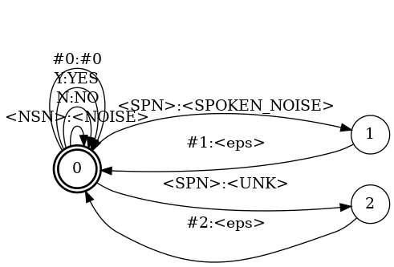
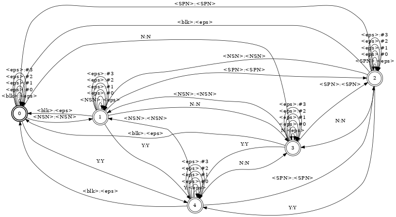

# 搭建你的第一个CAT项目

我们将一步步利用CAT和yesno数据搭建一个语音识别项目，请确保您已经完成了CAT的安装和环境配置。

## 文件准备

1. 在egs下创建目录yesno

2. 编写以下两个个文件

   - path.sh

     ```shell
     # CAT toolkit
     export CAT_ROOT=../../
     export PATH=$CAT_ROOT/src/ctc_crf/path_weight/build:$PATH
     export PATH=$PWD/ctc-crf:$PATH
     # Kaldi
     export KALDI_ROOT=${KALDI_ROOT:-/home/hpl/workspace/kaldi}
     [ -f $KALDI_ROOT/tools/env.sh ] && . $KALDI_ROOT/tools/env.sh
     export PATH=$PWD/utils/:$KALDI_ROOT/tools/openfst/bin:$PWD:$PATH
     [ ! -f $KALDI_ROOT/tools/config/common_path.sh ] && echo >&2 "The standard file $KALDI_ROOT/tools/config/common_path.sh is not present -> Exit!" && exit 1
     . $KALDI_ROOT/tools/config/common_path.sh
     export LC_ALL=C
     # Data
     export DATA_ROOT=data/yesno
     ```

     配置全局的环境变量，分别配置CAT、kaldi、数据集的环境变量，代码来源为wsj项目下的同名文件。

     创建完后可以在终端里运行一遍`. ./path.sh`方便接下来配置。

   - cmd.sh

     ```shell
     export train_cmd=run.pl
     export decode_cmd=run.pl
     export mkgraph_cmd=run.pl
     export cuda_cmd=run.pl
     ```

     这里也是沿用自kaldi的并行化工具，适应不同的环境可以配置queue.pl等以及不同的参数。此处使用run.pl即可。

3. 创建链接到kaldi以及cat工具包的目录，便于代码的编写以及迁移

   ```shell
   ln -s ../../scripts/ctc-crf ctc-crf
   ln -s $KALDI_ROOT/egs/wsj/s5/utils utils
   ln -s $KALDI_ROOT/egs/wsj/s5/steps steps
   ```

4. 创建local目录，存放本项目专用的数据处理，训练等脚本文件

5. 创建run.sh，在run.sh中完成我们整个工作流程的编写

   ```shell
   #!/bin/bash
   
   # Copyright 2018-2021 Tsinghua University
   # Author: Siwei Li
   # yesno for CAT
   
   # environment
   . ./cmd.sh
   . ./path.sh
   
   #set 
   H=`pwd`  # home dir
   n=12     # parallel jobs=$(nproc)
   stage=1  # set work stages
   stop_stage=9
   yesno=$DATA_ROOT  #data root
   
   . utils/parse_options.sh
   
   NODE=$1
   if [ ! $NODE ]; then
     NODE=0
   fi
   
   if [ $NODE == 0 ]; then
     if [ $stage -le 1 ] && [ $stop_stage -ge 1 ]; then
       echo "stage 1: *"
       # work
     fi
   
     #more stages
   fi
   ```

## 数据预处理

在step 1，我们完成以下步骤：获取数据，建立词典，训练语言模型。

以下为step 1的代码，在本节中我们会详细解释这部分代码的思路。

```shell
if [ $stage -le 1 ] && [ $stop_stage -ge 1 ]; then
  echo "stage 1: Data Preparation and FST Construction"

  local/prepare_data.sh || exit 1; # Get data and lists
  local/prepare_dict.sh || exit 1; # Get lexicon dict

  # Compile the lexicon and token FSTs
  # generate lexicon FST L.fst according to words.txt, generate token FST T.fst according to tokens.txt
  ctc-crf/ctc_compile_dict_token.sh --dict-type "phn" \
    data/dict data/local/lang_phn_tmp data/lang || exit 1;
  
  # Train and compile LMs. Generate G.fst according to lm, and compose FSTs into TLG.fst
  local/yesno_train_lms.sh data/train/text data/dict/lexicon.txt data/lm || exit 1;
  local/yesno_decode_graph.sh data/lm/srilm/srilm.o1g.kn.gz data/lang data/lang_test || exit 1;
fi
```

### prepare_data.sh

我们将数据准备的步骤集成到prepare_data.sh中，在prepare.sh完成后，我们期望获得以及划分为训练集与开发集的data（wav.scp），说话人信息（spk2utt,utt2spk，均为global），原文（text），分别存储在data/dev,data/train下，你也可以尝试自己实现这部分功能。

1. 在local目录下创建文件prepare_data.sh，并获取数据

   ```shell
   #!/usr/bin/env bash
   # This script prepares data and create necessary files
   
   . ./path.sh
   
   data=${H}/data
   local=${H}/local 
   mkdir -p ${data}/local
   
   cd ${data}
   
   # acquire data if not downloaded
   if [ ! -d waves_yesno ]; then
     echo "Getting Data"
     wget http://www.openslr.org/resources/1/waves_yesno.tar.gz || exit 1;
     tar -xvzf waves_yesno.tar.gz || exit 1;
     rm waves_yesno.tar.gz || exit 1;
   fi
   ```

   这一步完成后，我们在data/waves_yesno下得到原始数据，每个wav文件的标题为该文件的内容。

2. 将数据划分为训练集和开发集

   注：此处直接将开发集作为测试集，可以修改

   ```shell
   echo "Preparing train and dev data"
   
   rm -rf train dev
   
   # Create waves list and Divide into dev and train set
   waves_dir=${data}/waves_yesno
   ls -1 $waves_dir | grep "wav" > ${data}/local/waves_all.list
   cd ${data}/local
   ${local}/create_yesno_waves_test_train.pl waves_all.list waves.dev waves.train
   ```

   **create_yesno_waves_test_train.pl**

   注：这部分代码来源于kaldi中yesno项目

   ```perl
   #!/usr/bin/env perl
   
   $full_list = $ARGV[0];
   $test_list = $ARGV[1];
   $train_list = $ARGV[2];
   
   open FL, $full_list;
   $nol = 0;
   while ($l = <FL>)
   {
   	$nol++;
   }
   close FL;
   
   $i = 0;
   open FL, $full_list;
   open TESTLIST, ">$test_list";
   open TRAINLIST, ">$train_list";
   while ($l = <FL>)
   {
   	chomp($l);
   	$i++;
   	if ($i <= $nol/2 )
   	{
   		print TRAINLIST "$l\n";
   	}
   	else
   	{
   		print TESTLIST "$l\n";
   	}
   }
   ```

   等分$full_list:waves_all.list到waves.dev, waves.train

3. 生成\*_wav.scp, \*.txt(\*代指train, test, dev)

   ```shell
   cd ${data}/local
   
   for x in train dev; do
     # create id lists
     ${local}/create_yesno_wav_scp.pl ${waves_dir} waves.$x > ${x}_wav.scp #id to wavfile
     ${local}/create_yesno_txt.pl waves.$x > ${x}.txt #id to content
   done
   
   ${local}/create_yesno_wav_scp.pl ${waves_dir} waves.dev > test_wav.scp #id to wavfile
   ${local}/create_yesno_txt.pl waves.dev > test.txt #id to content
   ```

   **create_yesno_wav_scp.pl**

   ```perl
   #!/usr/bin/env perl
   
   $waves_dir = $ARGV[0];
   $in_list = $ARGV[1];
   
   open IL, $in_list;
   
   while ($l = <IL>)
   {
   	chomp($l);
   	$full_path = $waves_dir . "\/" . $l;
   	$l =~ s/\.wav//;
   	print "$l $full_path\n";
   }
   ```

   **create_yesno_txt.pl**

   ```perl
   #!/usr/bin/env perl
   
   $in_list = $ARGV[0];
   
   open IL, $in_list;
   
   while ($l = <IL>)
   {
   	chomp($l);
   	$l =~ s/\.wav//;
   	$trans = $l;
   	$trans =~ s/0/NO/g;
   	$trans =~ s/1/YES/g;
   	$trans =~ s/\_/ /g;
   	print "$l $trans\n";
   }
   ```

4. 将数据转移到data/dev, data/train, data/test下，并生成utt2spk, spk2utt

   ```shell
   for x in train dev test; do
     # sort wave lists and create utt2spk, spk2utt
     mkdir -p $x
     sort local/${x}_wav.scp -o $x/wav.scp
     sort local/$x.txt -o $x/text
     cat $x/text | awk '{printf("%s global\n", $1);}' > $x/utt2spk
     sort $x/utt2spk -o $x/utt2spk
     ${H}/utils/utt2spk_to_spk2utt.pl < $x/utt2spk > $x/spk2utt
   done
   ```

   这一流程完成后，data下的目录结构为：

   ```
   |-- dev #开发集
   |   |-- spk2utt #说话人-音频名
   |   |-- text #音频名-文本
   |   |-- utt2spk #音频名-说话人
   |   `-- wav.scp #音频名-文件位置
   |-- train #训练集
   |   |-- spk2utt
   |   |-- text
   |   |-- utt2spk
   |   `-- wav.scp
   |-- test #测试集
   |   |-- spk2utt
   |   |-- text
   |   |-- utt2spk
   |   `-- wav.scp
   |-- local #中间文件
   |   |-- dev.txt #开发集的text
   |   |-- dev_wav.scp #开发集的wav.scp
   |   |-- test.txt
   |   |-- test_wav.scp
   |   |-- train.txt
   |   |-- train_wav.scp
   |   |-- waves.dev #开发集的文件名列表
   |   |-- waves.train
   |   `-- waves_all.list
   `-- waves_yesno #数据储存位置
   ```

   以下展示train目录下的文件的部分内容：

   **spk2utt**

   ```
   global 0_0_0_0_1_1_1_1 0_0_0_1_0_0_0_1 0_0_0_1_0_1_1_0 0_0_1_0_0_0_1_0 0_0_1_0_0_1_1_0 0_0_1_0_0_1_1_1 0_0_1_0_1_0_0_0 0_0_1_0_1_0_0_1 0_0_1_0_1_0_1_1 0_0_1_1_0_0_0_1 0_0_1_1_0_1_0_0 0_0_1_1_0_1_1_0 0_0_1_1_0_1_1_1 0_0_1_1_1_0_0_0 0_0_1_1_1_0_0_1 0_0_1_1_1_1_0_0 0_0_1_1_1_1_1_0 0_1_0_0_0_1_0_0 0_1_0_0_0_1_1_0 0_1_0_0_1_0_1_0 0_1_0_0_1_0_1_1 0_1_0_1_0_0_0_0 0_1_0_1_1_0_1_0 0_1_0_1_1_1_0_0 0_1_1_0_0_1_1_0 0_1_1_0_0_1_1_1 0_1_1_1_0_0_0_0 0_1_1_1_0_0_1_0 0_1_1_1_0_1_0_1 0_1_1_1_1_0_1_0
   ```

   **utt2spk**

   ```
   0_0_0_0_1_1_1_1 global
   0_0_0_1_0_0_0_1 global
   0_0_0_1_0_1_1_0 global
   0_0_1_0_0_0_1_0 global
   0_0_1_0_0_1_1_0 global
   ...
   ```

   **wav.scp**

   ```
   0_0_0_0_1_1_1_1 /home/hpl/workspace/CAT/egs/yesno/data/waves_yesno/0_0_0_0_1_1_1_1.wav
   0_0_0_1_0_0_0_1 /home/hpl/workspace/CAT/egs/yesno/data/waves_yesno/0_0_0_1_0_0_0_1.wav
   0_0_0_1_0_1_1_0 /home/hpl/workspace/CAT/egs/yesno/data/waves_yesno/0_0_0_1_0_1_1_0.wav
   0_0_1_0_0_0_1_0 /home/hpl/workspace/CAT/egs/yesno/data/waves_yesno/0_0_1_0_0_0_1_0.wav
   ...
   ```

   **text**

   ```
   0_0_0_0_1_1_1_1 NO NO NO NO YES YES YES YES
   0_0_0_1_0_0_0_1 NO NO NO YES NO NO NO YES
   0_0_0_1_0_1_1_0 NO NO NO YES NO YES YES NO
   0_0_1_0_0_0_1_0 NO NO YES NO NO NO YES NO
   0_0_1_0_0_1_1_0 NO NO YES NO NO YES YES NO
   ...
   ```

   通过生成这些固定格式的文件，我们可以方便地使用kaldi的工具优化工作流程。

   你现在的目录结构应该是：

   ```
   |-- cmd.sh
   |-- ctc-crf -> ../../scripts/ctc-crf
   |-- data
   |   |-- dev
   |   |-- local
   |   |-- test
   |   |-- train
   |   `-- waves_yesno
   |-- local
   |   |-- create_yesno_txt.pl
   |   |-- create_yesno_wav_scp.pl
   |   |-- create_yesno_waves_test_train.pl
   |   |-- prepare_data.sh
   |-- path.sh
   |-- run.sh
   |-- steps -> /home/hpl/workspace/kaldi/egs/wsj/s5/steps
   `-- utils -> /home/hpl/workspace/kaldi/egs/wsj/s5/utils
   ```

### prepare_dict.sh

将词典准备的工作集成到prepare_dict.sh中。

通过这部分代码，我们期待在data/dict下获得经过去重和补充噪音，未知发音等的词典lexicon.txt，排序并用数字标准的音素units.txt，以及用数字标号的词典，lexicon_numbers.txt。

1. 自己准备原始词典，在input/lexicon.txt中

   ```
   <SIL> SIL
   YES Y
   NO N
   ```

2. 编写local/prepare_dict.sh，详见注释

   ```shell
   #!/bin/bash
   
   # This script prepares the phoneme-based lexicon. It also generates the list of lexicon units
   # and represents the lexicon using the indices of the units. 
   
   dir=${H}/data/dict
   mkdir -p $dir
   srcdict=input/lexicon.txt
   
   . ./path.sh
   
   # Check if lexicon dictionary exists
   [ ! -f "$srcdict" ] && echo "No such file $srcdict" && exit 1;
   
   # Raw dictionary preparation
   # grep removes SIL, perl removes repeated lexicons
   cat $srcdict | grep -v "SIL" | \
     perl -e 'while(<>){@A = split; if(! $seen{$A[0]}) {$seen{$A[0]} = 1; print $_;}}' \
     > $dir/lexicon_raw.txt || exit 1;
   
   # Get the set of units in the lexicon without noises
   # cut: remove words, tr: remove spaces and lines, sort -u: sort and unique
   cut -d ' ' -f 2- $dir/lexicon_raw.txt | tr ' ' '\n' | sort -u > $dir/units_raw.txt
   
   # add noises for lexicons
   (echo '<SPOKEN_NOISE> <SPN>'; echo '<UNK> <SPN>'; echo '<NOISE> <NSN>'; ) | \
    cat - $dir/lexicon_raw.txt | sort | uniq > $dir/lexicon.txt || exit 1;
   
   # add noises and number the units
   (echo '<NSN>'; echo '<SPN>';) | cat - $dir/units_raw.txt | awk '{print $1 " " NR}' > $dir/units.txt
   
   # Convert phoneme sequences into the corresponding sequences of units indices, encoded by units.txt
   utils/sym2int.pl -f 2- $dir/units.txt < $dir/lexicon.txt > $dir/lexicon_numbers.txt
   
   echo "Phoneme-based dictionary preparation succeeded"
   ```
   
   这一脚本运行完成后，data目录下生成了一个dict文件夹：
   
   ```
   |-- dict
   |   |-- lexicon_raw.txt #原词典去重和去非语言学发音
   |   |-- units_raw.txt #lexicon_raw词典中的所有音素去重
   |   |-- lexicon.txt #lexicon_raw词典加入非语言学发音并排序
   |   |-- units.txt #units_raw加入非语言学发音并排序标号
   |   `-- lexicon_numbers.txt #用units.txt中的音素标号替代词典中的音素
   ```
   
   以下展示dict中文件的部分内容：
   
   **lexicon_raw.txt**
   
   ```
   YES Y
   NO N
   ```
   
   **units_raw.txt**
   
   ```
   N
   Y
   ```
   
   **lexicon.txt**
   
   ```
   <NOISE> <NSN>
   <SPOKEN_NOISE> <SPN>
   <UNK> <SPN>
   NO N
   YES Y
   ```
   
   **units.txt**
   
   ```
   <NSN> 1
   <SPN> 2
   N 3
   Y 4
   ```
   
   **lexicon_numbers.txt**
   
   ```
   <NOISE> 1
   <SPOKEN_NOISE> 2
   <UNK> 2
   NO 3
   YES 4
   ```
   
   在yesno数据集中并没有自然噪音和说话噪音，所以你可以修改代码去掉这部分因素。

### L.fst & T.fst

这时，你需要对FST（Finite State Transducers 有限状态转换器）有一定的了解，安装的openfst正是为了处理这类模型。

根据发音词典，ctc需要的token\<eps>,\<blk>，生成词典(lexicon)的L.fst以及音素(token)的T.fst，此处用到我们在prepare_dict.sh中准备好的lexicon.txt, units.txt, lexicon_numbers.txt这3个文件。

```shell
# Compile the lexicon and token FSTs
# generate lexicon FST L.fst according to words.txt, generate token FST T.fst according to tokens.txt
ctc-crf/ctc_compile_dict_token.sh --dict-type "phn" \
  data/dict data/local/lang_phn_tmp data/lang || exit 1;
```

详见ctc-crf/ctc_compile_dict_token.sh的注释。

***此处可以继续进行fst文件的可视化工作，参考[https://www.cnblogs.com/welen/p/7611320.html],[https://www.dazhuanlan.com/shitou103/topics/1489883]***

这一步中，脚本先通过lexicon_numbers.txt, units.txt生成了words.txt, tokens.txt，然后生成了T.fst, L.fst。

**words.txt**

```
<eps> 0
<NOISE> 1
<SPOKEN_NOISE> 2
<UNK> 3
NO 4
YES 5
#0 6
<s> 7
</s> 8
```

**tokens.txt**

```
<eps> 0
<blk> 1
<NSN> 2
<SPN> 3
N 4
Y 5
#0 6
#1 7
#2 8
#3 9
```

为了方便理解，以下通过fstprint展示我们生成的fst文件：

**L.fst**



**T.fst**



### G.fst

根据train/text,dict/lexicon.txt，生成语言模型的G.fst。

这部分训练我们通过srilm工具完成，集成到local/yesno_train_lms.sh中。

```shell
# Train and compile LMs. Generate G.fst according to lm, and compose FSTs into TLG.fst
    local/yesno_train_lms.sh data/train/text data/dict/lexicon.txt data/lm || exit 1;
```

**yesno_train_lms.sh**

```shell
#!/bin/bash

# To be run from one directory above this script.

. ./path.sh

text=$1
lexicon=$2
dir=$3
for f in "$text" "$lexicon"; do
  [ ! -f $x ] && echo "$0: No such file $f" && exit 1;
done

#text=data/train/text
#lexicon=data/dict/lexicon.txt
#dir=data/lm
mkdir -p $dir

cleantext=$dir/text.no_oov

cat $text | awk -v lex=$lexicon 'BEGIN{while((getline<lex) >0){ seen[$1]=1; } } 
  {for(n=1; n<=NF;n++) {  if (seen[$n]) { printf("%s ", $n); } else {printf("<UNK> ");} } printf("\n");}' \
  > $cleantext || exit 1;

cat $cleantext | awk '{for(n=2;n<=NF;n++) print $n; }' | sort | uniq -c | \
   sort -nr > $dir/word.counts || exit 1;

# Get counts from acoustic training transcripts, and add  one-count
# for each word in the lexicon (but not silence, we don't want it
# in the LM-- we'll add it optionally later).
cat $cleantext | awk '{for(n=2;n<=NF;n++) print $n; }' | \
  cat - <(grep -w -v '!SIL' $lexicon | awk '{print $1}') | \
   sort | uniq -c | sort -nr > $dir/unigram.counts || exit 1;

# note: we probably won't really make use of <UNK> as there aren't any OOVs
cat $dir/unigram.counts  | awk '{print $2}' | ${H}/local/get_word_map.pl "<s>" "</s>" "<UNK>" > $dir/word_map \
   || exit 1;

# note: ignore 1st field of train.txt, it's the utterance-id.
cat $cleantext | awk -v wmap=$dir/word_map 'BEGIN{while((getline<wmap)>0)map[$1]=$2;}
  { for(n=2;n<=NF;n++) { printf map[$n]; if(n<NF){ printf " "; } else { print ""; }}}' | gzip -c >$dir/train.gz \
   || exit 1;

# LM is small enough that we don't need to prune it (only about 0.7M N-grams).

# From here is some commands to do a baseline with SRILM (assuming
# you have it installed).
heldout_sent=3 
sdir=$dir/srilm
mkdir -p $sdir
cat $cleantext | awk '{for(n=2;n<=NF;n++){ printf $n; if(n<NF) printf " "; else print ""; }}' | \
  head -$heldout_sent > $sdir/heldout
cat $cleantext | awk '{for(n=2;n<=NF;n++){ printf $n; if(n<NF) printf " "; else print ""; }}' | \
  tail -n +$heldout_sent > $sdir/train

cat $dir/word_map | awk '{print $1}' | cat - <(echo "<s>"; echo "</s>" ) > $sdir/wordlist

ngram-count -text $sdir/train -order 1 -limit-vocab -vocab $sdir/wordlist -unk \
  -map-unk "<UNK>" -interpolate -lm $sdir/srilm.o1g.kn.gz
# -kndiscount
ngram -lm $sdir/srilm.o1g.kn.gz -ppl $sdir/heldout 
```

取3句计算困惑度，运行结果如下：

```
file data/lm/srilm/heldout: 3 sentences, 24 words, 0 OOVs
0 zeroprobs, logprob= -11.09502 ppl= 2.575885 ppl1= 2.899294
```

***此处代码待添加注释***

srilm工具的使用可以见工具的readme，训练中需要处理的文件储存在data/lm目录下，我们将srilm的训练结果存储在data/lm/srilm下，使用1-gram的语言模型结果储存到srilm.o1g.kn中，语言模型如下：

**srilm.o1g.km**

```

\data\
ngram 1=7

\1-grams:
-0.9542425	</s>
-99	<NOISE>
-99	<SPOKEN_NOISE>
-99	<UNK>
-99	<s>
-0.3079789	NO
-0.4014005	YES

\end\
```

### TLG.fst

把以上生成的fst文件合成到TLG.fst中。

```shell
local/yesno_decode_graph.sh data/lm/srilm/srilm.o1g.kn.gz data/lang data/lang_test || exit 1;
```

这部分代码中，我们先将语言模型根据word.txt打包到G.fst中，因为语言模型已经足够直观，此处不再做可视化，然后用openfst合成TLG.fst用于训练。

**yesno_decode_graph.sh**

```shell
#!/bin/bash 
#

if [ -f path.sh ]; then . path.sh; fi

#lm_dir=$1
arpa_lm=$1
src_lang=$2
tgt_lang=$3

#arpa_lm=${lm_dir}/3gram-mincount/lm_unpruned.gz
[ ! -f $arpa_lm ] && echo No such file $arpa_lm && exit 1;

rm -rf $tgt_lang
cp -r $src_lang $tgt_lang

# Compose the language model to FST
gunzip -c "$arpa_lm" | \
   grep -v '<s> <s>' | \
   grep -v '</s> <s>' | \
   grep -v '</s> </s>' | \
   arpa2fst - | fstprint | \
   utils/remove_oovs.pl /dev/null | \
   utils/eps2disambig.pl | utils/s2eps.pl | fstcompile --isymbols=$tgt_lang/words.txt \
     --osymbols=$tgt_lang/words.txt  --keep_isymbols=false --keep_osymbols=false | \
    fstrmepsilon | fstarcsort --sort_type=ilabel > $tgt_lang/G.fst


echo  "Checking how stochastic G is (the first of these numbers should be small):"
fstisstochastic $tgt_lang/G.fst 

# Compose the token, lexicon and language-model FST into the final decoding graph
fsttablecompose $tgt_lang/L.fst $tgt_lang/G.fst | fstdeterminizestar --use-log=true | \
    fstminimizeencoded | fstarcsort --sort_type=ilabel > $tgt_lang/LG.fst || exit 1;
fsttablecompose $tgt_lang/T.fst $tgt_lang/LG.fst > $tgt_lang/TLG.fst || exit 1;

echo "Composing decoding graph TLG.fst succeeded"
rm -r $tgt_lang/LG.fst   # We don't need to keep this intermediate FST
```

到此，我们完成了样本文件的准备以及TLG.fst的生成。

现在你的data目录结构应该如下：

```
├── dev
│   ├── spk2utt
│   ├── text
│   ├── utt2spk
│   └── wav.scp
├── test
│   ...
├── train
│   ...
├── dict
│   ├── lexicon_numbers.txt
│   ├── lexicon_raw.txt
│   ├── lexicon.txt
│   ├── units_raw.txt
│   └── units.txt
├── lang
│   ├── lexicon_numbers.txt
│   ├── L.fst
│   ├── T.fst
│   ├── tokens.txt
│   ├── units.txt
│   └── words.txt
├── lang_test
│   ├── G.fst
│   ├── lexicon_numbers.txt
│   ├── L.fst
│   ├── T.fst
│   ├── TLG.fst
│   ├── tokens.txt
│   ├── units.txt
│   └── words.txt
├── lm
│   ├── srilm
│   ├── text.no_oov
│   ├── train.gz
│   ├── unigram.counts
│   ├── word.counts
│   └── word_map
├── local
│   ├── dev.txt
│   ├── dev_wav.scp
│   ├── lang_phn_tmp
│   ├── test.txt
│   ├── test_wav.scp
│   ├── train.txt
│   ├── train_wav.scp
│   ├── waves_all.list
│   ├── waves.dev
│   └── waves.train
└── waves_yesno
```

请再次确认你是否理解这个目录结构中每个文件的来源和意义。

## 提取FBank特征

第二步我们提取声音文件的特征，这一部分中我对音频进行变速并在fbank文件夹下得到提取完成的音频的FBank特征。

注意在conf目录下建立fbank.conf文件，内容为：

```
--sample-frequency=8000
--num-mel-bins=40
```

分别为音频采样率和滤波器个数，yesno数据集数据采样率为8000，滤波器个数我们取40。

***关于FBank：[https://www.jianshu.com/p/b25abb28b6f8]***

```shell
if [ $stage -le 2 ] && [ $stop_stage -ge 2 ]; then
  echo "stage 2: FBank Feature Generation"
  #perturb the speaking speed to achieve data augmentation
  utils/data/perturb_data_dir_speed_3way.sh data/train data/train_sp
  utils/data/perturb_data_dir_speed_3way.sh data/dev data/dev_sp
  
  # Generate the fbank features; by default 40-dimensional fbanks on each frame
  fbankdir=fbank
  for set in train_sp dev_sp; do
    steps/make_fbank.sh --cmd "$train_cmd" --nj 1 data/$set exp/make_fbank/$set $fbankdir || exit 1;
    utils/fix_data_dir.sh data/$set || exit;  #filter and sort the data files
    steps/compute_cmvn_stats.sh data/$set exp/make_fbank/$set $fbankdir || exit 1;  #achieve cmvn normalization
  done

  for set in test; do
    steps/make_fbank.sh --cmd "$train_cmd" --nj 1 data/$set exp/make_fbank/$set $fbankdir || exit 1;
    utils/fix_data_dir.sh data/$set || exit;  #filter and sort the data files
    steps/compute_cmvn_stats.sh data/$set exp/make_fbank/$set $fbankdir || exit 1;  #achieve cmvn normalization
  done
fi
```

在提取声音文件的特征时，此处使用了将声音进行0.9 1.0 1.1三种变速的操作，在一些数据集上可以取得更好的WER，yesno上无需采用该操作，此处使用该代码作为演示。

utils/data/perturb_data_dir_speed_3way.sh：变速

steps/make_fbank.sh：fbank提取

utils/fix_data_dir.sh：数据排序和过滤

steps/compute_cmvn_stats.sh：特征正则化

## 权重计算

在这一部分过程中，我们先得到得到标号储存的数据文件，并通过计算基于音素的语言模型和音素得到den_lm.fst，由此和数据文件联合计算lable序列中的logp(l)。详细的步骤朱宸睿学长已经进行了注释。

```shell

    echo "If you want to update it, please manualif [ $stage -le 3 ] && [ $stop_stage -ge 3 ]; then
  python3 ctc-crf/prep_ctc_trans.py data/lang_phn/lexicon_numbers.txt $data_tr/text "<UNK>" > $data_tr/text_number || exit 1
  python3 ctc-crf/prep_ctc_trans.py data/lang_phn/lexicon_numbers.txt $data_cv/text "<UNK>" > $data_cv/text_number || exit 1
  echo "Convert text_number finished"

  # Prepare denominator
  python3 ctc-crf/prep_ctc_trans.py data/lang_phn/lexicon_numbers.txt data/train_tr95/text "<UNK>" > data/train_tr95/text_number || exit 1
  cat data/train_tr95/text_number | sort -k 2 | uniq -f 1 > data/train_tr95/unique_text_number || exit 1
  mkdir -p data/den_meta
  chain-est-phone-lm ark:data/train_tr95/unique_text_number data/den_meta/phone_lm.fst || exit 1
  python3 ctc-crf/ctc_token_fst_corrected.py den data/lang_phn/tokens.txt | fstcompile | fstarcsort --sort_type=olabel > data/den_meta/T_den.fst || exit 1
  fstcompose data/den_meta/T_den.fst data/den_meta/phone_lm.fst > data/den_meta/den_lm.fst || exit 1
  echo "Prepare denominator finished"

  # For label sequence l, log p(l) also appears in the numerator but behaves like an constant. So log p(l) is
  # pre-calculated based on the denominator n-gram LM and saved, and then applied in training.
  path_weight $data_tr/text_number data/den_meta/phone_lm.fst > $data_tr/weight || exit 1
  path_weight $data_cv/text_number data/den_meta/phone_lm.fst > $data_cv/weight || exit 1
  echo "Prepare weight finished"
fi
```

## 整合数据

不同项目中，这部分处理差别不大，我们对数据集的的特征进行正则化并和以上计算的weights一起整合到data/pickle下。

```shell
if [ $stage -le 4 ] && [ $stop_stage -ge 4 ]; then
  mkdir -p data/all_ark
  
  for set in test; do
    eval data_$set=data/$set
  done

  for set in test cv tr; do
    tmp_data=`eval echo '$'data_$set`

    #apply CMVN feature normalization, calculate delta features, then sub-sample the input feature sequence
    feats="ark,s,cs:apply-cmvn --norm-vars=true --utt2spk=ark:$tmp_data/utt2spk scp:$tmp_data/cmvn.scp scp:$tmp_data/feats.scp ark:- \
    | add-deltas ark:- ark:- | subsample-feats --n=3 ark:- ark:- |"

    ark_dir=$(readlink -f data/all_ark)/$set.ark
    #copy feature files, generate scp and ark files to save features.
    copy-feats "$feats" "ark,scp:$ark_dir,data/all_ark/$set.scp" || exit 1
  done
fi

if [ $stage -le 5 ] && [ $stop_stage -ge 5 ]; then
  mkdir -p data/pickle
  #create a pickle file to save the feature, text_number and path weights.
  python3 ctc-crf/convert_to.py -f=pickle -W \
      data/all_ark/cv.scp $data_cv/text_number $data_cv/weight data/pickle/cv.pickle || exit 1
  python3 ctc-crf/convert_to.py -f=pickle \
      data/all_ark/tr.scp $data_tr/text_number $data_tr/weight data/pickle/tr.pickle || exit 1
fi
```

## 训练

此时训练需要的所有数据已经准备完成，剩下只需要在exp下建立你的一次训练的文件夹（例：demo），建立config.json，此处yesno我们采用：

```json
{
    "net": {
        "type": "BLSTM",
        "lossfn": "crf",
        "lamb": 0.01,
        "kwargs": {
            "n_layers": 3,
            "idim": 120,
            "hdim": 320,
            "num_classes": 5,
            "dropout": 0.5
        }
    },
    "scheduler": {
        "type": "SchedulerEarlyStop",
        "optimizer": {
            "type_optim": "Adam",
            "kwargs": {
                "lr": 1e-3,
                "betas": [
                    0.9,
                    0.99
                ],
                "weight_decay": 0.0
            }
        },
        "kwargs": {
            "epoch_min": 4,
            "lr_stop": 1e-5,
            "reverse_metric_direc": true
        }
    }
}
```

训练的代码如下：

```shell
PARENTDIR='.'
dir="exp/demo"
DATAPATH=$PARENTDIR/data/

if [ $stage -le 6 ] && [ $stop_stage -ge 6 ]; then
  unset CUDA_VISIBLE_DEVICES

  if [[ $NODE == 0 && ! -f $dir/scripts.tar.gz ]]; then
    echo ""
    tar -zcf $dir/scripts.tar.gz $(readlink ctc-crf) $0
  elif [ $NODE == 0 ]; then
    echo ""
    echo "'$dir/scripts.tar.gz' already exists."
    echo "If you want to update it, please manually rm it then re-run this script."
  fi

  # uncomment the following line if you want to use specified GPUs
  CUDA_VISIBLE_DEVICES="0"                      \
  python3 ctc-crf/train.py --seed=0             \
    --world-size 1 --rank $NODE                 \
    --batch_size=3                              \
    --dir=$dir                                  \
    --config=$dir/config.json                   \
    --data=$DATAPATH                            \
    || exit 1
fi
```

通过以上代码即可完成训练，训练的过程可以在你的demo目录下的monitor.jpg中找到。

如果需要重新训练，删除scripts.tar.gz和ckpt文件夹即可，yesno数据集的训练可能不太稳定，如果训练集loss不下降，可以考虑重新训练。

## 测试

计算测试集的logits并解码。

```shell
nj=1
if [ $stage -le 7 ] && [ $stop_stage -ge 7 ]; then
  for set in test; do
    ark_dir=$dir/logits/$set
    mkdir -p $ark_dir
    python3 ctc-crf/calculate_logits.py               \
      --resume=$dir/ckpt/infer.pt                     \
      --config=$dir/config.json                       \
      --nj=$nj --input_scp=data/all_ark/$set.scp      \
      --output_dir=$ark_dir                           \
      || exit 1
  done
fi


if [ $stage -le 8 ] && [ $stop_stage -ge 8 ]; then
  for set in test; do
    mkdir -p $dir/decode_${set}
    ln -s $(readlink -f $dir/logits/$set) $dir/decode_${set}/logits
    ctc-crf/decode.sh --stage 1 \
        --cmd "$decode_cmd" --nj 1 --acwt 1.0 --post_decode_acwt 1.0\
        data/lang_${set} data/${set} data/all_ark/${set}.scp $dir/decode_${set}
  done
fi

if [ $stage -le 9 ] && [ $stop_stage -ge 9 ]; then
  for set in test; do
    grep WER $dir/decode_${set}/wer_* | utils/best_wer.sh
  done
fi
```

恭喜你已经完成了你的第一个yesno项目的搭建，训练和解码。

现在你的目录结构应该如下图所示：

```
├── cmd.sh
├── conf
│   ├── decode_dnn.config
│   ├── fbank.conf
│   └── mfcc.conf
├── ctc-crf -> ../../scripts/ctc-crf
├── exp
│   └── demo
├── input
│   └── lexicon.txt
├── local
│   ├── create_yesno_txt.pl
│   ├── create_yesno_waves_test_train.pl
│   ├── create_yesno_wav_scp.pl
│   ├── get_word_map.pl
│   ├── prepare_data.sh
│   ├── prepare_dict.sh
│   ├── score.sh
│   ├── yesno_decode_graph.sh
│   └── yesno_train_lms.sh
├── path.sh
├── run.sh
├── steps -> /home/hpl/workspace/kaldi/egs/wsj/s5/steps
└── utils -> /home/hpl/workspace/kaldi/egs/wsj/s5/utils
```

以下是其中一次训练的结果展示：


识别的结果如下：

```
%WER 5.00 [ 12 / 240, 0 ins, 9 del, 3 sub ] 
```

识别的详细log在exp/demo/decode_test中。
